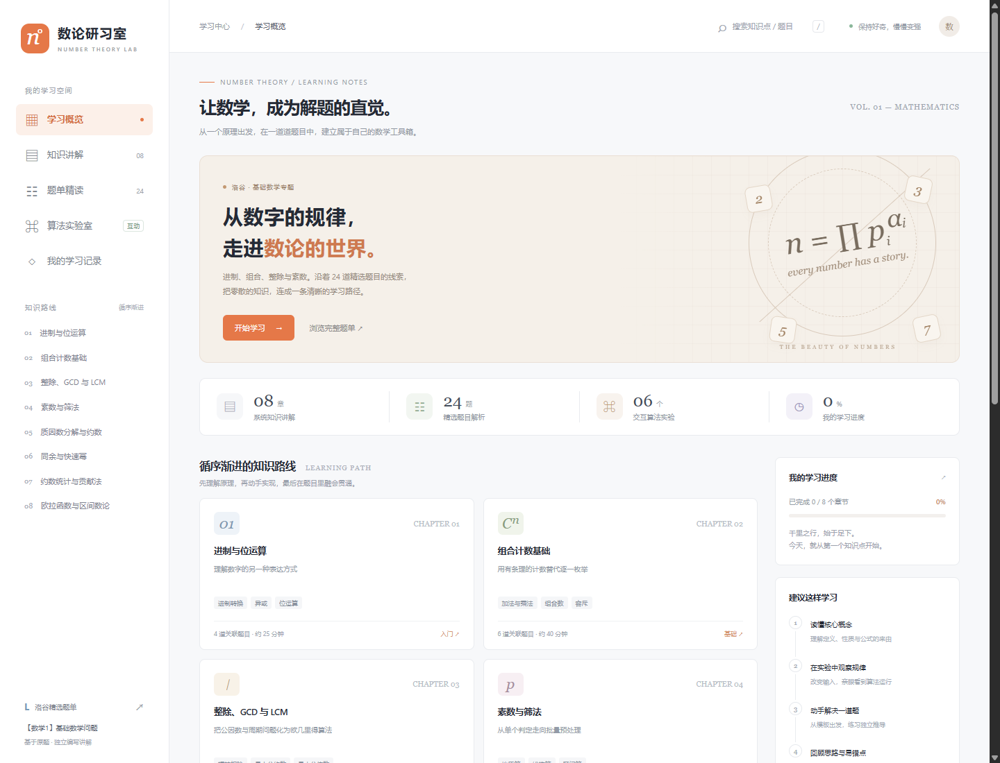
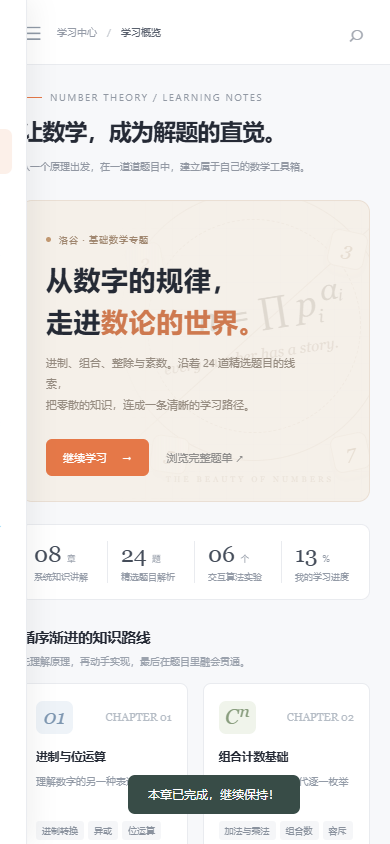

# 数论研习室

基于洛谷题单 [117「【数学1】基础数学问题」](https://www.luogu.com.cn/training/117) 的中文静态学习网站。题单和 24 道原题题面于 2026-09-20 核对，讲解为独立编写，并非洛谷官方题解转载。

适合已掌握 C++ 基本语法、循环、数组和函数，准备系统练习数学题的学习者。用 **8 个知识章节、24 道题目讲解、6 个算法实验**，串起进制、组合计数与基础数论。



## 快速开始

直接用浏览器打开 `index.html` 即可。所有样式、字体替代方案、脚本和内容均不依赖 CDN，可离线阅读。跳转原题需要网络。

安装 Node.js 后，也可在项目根目录运行：

```sh
node server.js
```

访问 [http://127.0.0.1:4173](http://127.0.0.1:4173)，按 `Ctrl+C` 停止服务。服务仅监听本机，端口固定为 4173。项目没有 npm 依赖，不需要运行 `npm install`。浏览器需要启用 JavaScript，并支持 BigInt 和原生 dialog；建议使用近期版本的 Chrome、Edge、Firefox 或 Safari。

## 内容

- 8 个章节：进制与位运算、组合计数、GCD/LCM、筛法、质因数与约数、同余与快速幂、贡献法与整除分块、欧拉函数。
- 24 道题的题意概括、分步思路、例子、复杂度和易错点。
- C++17 核心模板（需要自行补充头文件、命名空间及题目输入输出；部分模板使用 GNU 扩展 `__int128`）。
- 6 个可交互实验，以及每章一道概念自测。
- 关键词搜索、章节筛选、收藏、完成标记、学习记录导出、章节打印。

学习记录保存在浏览器的 localStorage 中。文件方式和 HTTP 方式打开时的存储空间可能不同；隐私模式或禁用存储时退化为本次会话记录。题目完成状态由学习者手工记录，不与洛谷账户联动。

按 `/` 可打开搜索，支持题号、标题和知识点关键词，按 `Esc` 关闭弹窗。章节末尾可以标记完成或打印为 PDF。学习记录可导出 JSON，目前没有导入功能；导出文件用于留存和查阅。换浏览器、换端口或清除浏览器数据可能看不到原来的记录；存储不可用时，刷新或关闭页面后记录可能丢失。

## 学习路线与题目索引

建议先理解原理，在实验室观察小例子，再独立实现并到洛谷提交，最后回看易错点。章节预计用时只包含阅读与理解，刷题可另行安排。

| 章节 | 核心内容 | 关联题号 |
| --- | --- | --- |
| 01 进制与位运算 | 位权、正负进制、异或、移位 | P1143、P1469、P1100、P1017 |
| 02 组合计数基础 | 乘法原理、杨辉三角、容斥、隔板法、排名、可达性 DP | P1866、P2822、P2789、P3913、P2638、P1246 |
| 03 整除、GCD 与 LCM | 辗转相除、互质关系、分数运算、消因子 | P1029、P1072、P1572、P4057、P2651、P2660 |
| 04 素数与筛法 | 埃氏筛、线性筛、区间筛 | P3383、P1835 |
| 05 质因数分解与约数 | 唯一分解、约数计数、指数约束、因子和 | P1069、P1593 |
| 06 同余与快速幂 | 模运算、快速幂、分治等比和 | P1593、P1866、P2822 |
| 07 约数统计与贡献法 | 倍数枚举、后缀最大值、整除分块 | P2926、P1414、P1403 |
| 08 欧拉函数与区间数论 | 容斥、欧拉函数、区间分解 | P3601 |

部分题目关联多个章节，去重后共 24 道。入门可从 P1143 → P1469 → P3383 → P1029 开始。组合计数中的 DP、二维前缀和，以及区间欧拉函数可以在掌握基础后回看。

<details>
<summary>查看手机端预览</summary>



</details>

## 文件

- `index.html`：页面框架。
- `styles.css`：响应式布局与打印样式。
- `content.js`：章节及题目讲解。
- `app.js`：路由、搜索、进度、算法实验。
- `source-problems.json`：读取原题时的题面数据快照，供核对；不在页面加载。
- `fetch-source.ps1`：更新题面快照的可选脚本，需网络访问。
- `server.js`：可选的 Node.js 本地预览服务，无 npm 依赖。
- `verify-math.js`：提取并编译部分页面模板，核对小规模计算结果。
- `verify-browser.js`：浏览器交互、手机布局与离线打开检查，生成预览截图。
- `preview-desktop.png` / `preview-mobile.png`：README 使用的页面截图。

`.verification/` 保存编译验证产物，`.browser-test/` 用于专用测试浏览器配置；两者均被 Git 忽略。

网站不自动提交题解、不访问个人洛谷数据、不调用外部统计服务。

## 修改与验证

使用 UTF-8 保存文本。在 Windows PowerShell 中读取中文文件时，使用 `Get-Content -Encoding UTF8`。修改课程时，在 `content.js` 中同步检查章节关联题号、题目的主章节、自测答案和数据范围；页面部分总数为固定文案，增删章节或题目后也要同步更新 `app.js`、`index.html` 和本文。

### 语法与数学模板

在项目根目录执行：

```sh
node --check content.js
node --check app.js
node --check server.js
node verify-math.js
```

`node verify-math.js` 会从页面内容中提取核心 C++17 模板，使用本机 `g++` 编译并与独立的小规模计算结果对照。

`g++` 需要在 PATH 中，并支持 C++17 与 GNU 扩展 `__int128`。检查覆盖进制转换、GCD/LCM、质因数分解、快速幂、等比和及整除分块，不覆盖全部题目的完整解法，也不等同于洛谷评测通过。

### 浏览器验证

`node verify-browser.js` 使用 Chrome DevTools 协议检查页面，需要本地预览服务及监听 9222 端口的测试浏览器。它会重置测试浏览器内本站的学习记录，检查交互与移动布局，并生成桌面及手机截图；请仅对专用测试浏览器运行。

需要 **Node.js 22 或更新版本**（使用内置 `fetch` 与 `WebSocket`）、Chrome 或 Edge，以及运行中的 `node server.js`。Windows PowerShell 示例，在项目根目录新开终端启动测试浏览器：

```powershell
& 'C:\Program Files\Google\Chrome\Application\chrome.exe' --headless=new --remote-debugging-port=9222 --user-data-dir="$PWD/.browser-test" about:blank
```

随后在另一个终端运行 `node verify-browser.js`。其他系统可使用对应浏览器路径和相同参数。测试覆盖 8 章、24 题、搜索、筛选、收藏、完成标记、自测、6 个实验、边界输入、390px 手机布局、当前项目的文件方式打开及运行时异常。测试会覆盖两张预览截图；结束后关闭专用浏览器。

## 来源与维护

题目名称、题面与样例来自洛谷，讲解为独立编写。题面、难度和限制可能更新，提交时以原题页面为准。

需要重新获取快照时，在有网络访问的环境中运行：

```powershell
./fetch-source.ps1
```

脚本仅在 24 道题全部获取并通过基本内容检查后写入快照；任何一道失败都会保留现有文件。更新快照不会自动改写讲解、题目难度或核对日期，应人工比较差异后再同步修改。
